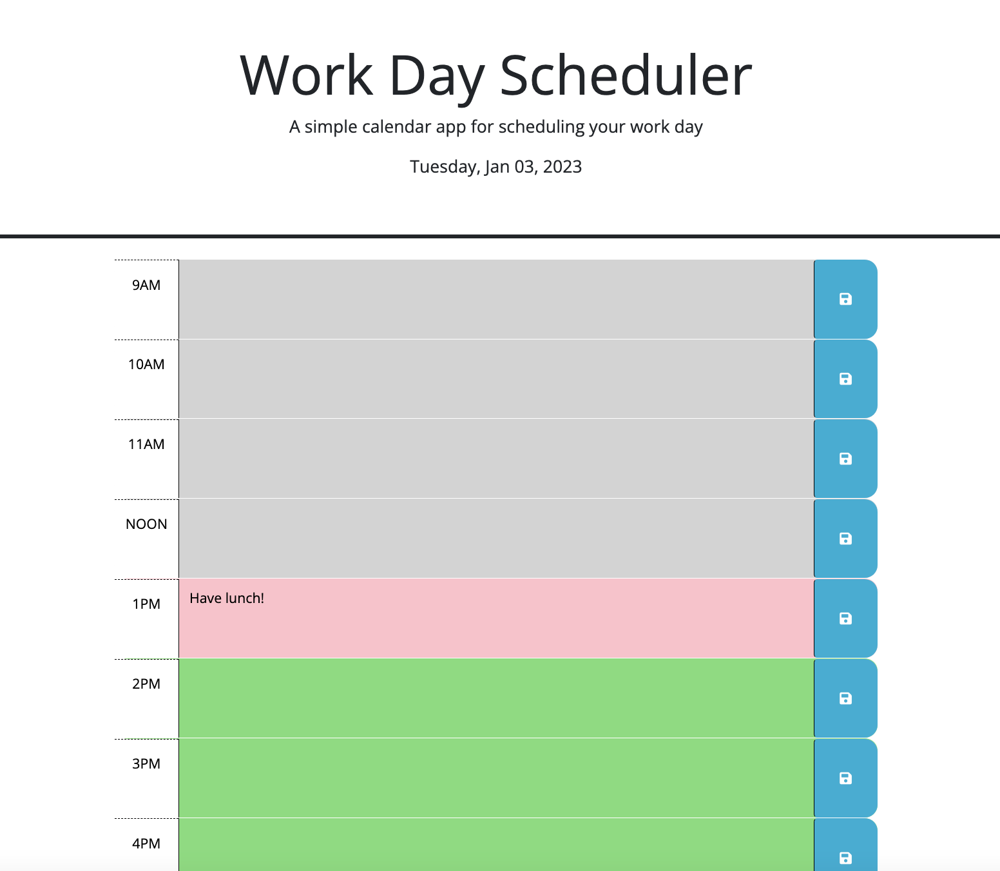

# dailyPlanner

## Description

I've created a calendar application that will display the current date, color differientate between past, present, and future, as well as save and retrieve content from local storage. This was done using jquery and day.js.

#### Criteria:

* Display current date
* Display time blocks for each hour of the work day
* View time blocks in color code of past, present, and future
* Data is saved into local storage and the save persists on the page if refreshed

#### End Product 
Below is a screenshot of the planner.

<!-- screenshots -->

<!-- link -->
#### Deployment
Here is the [link](https://gaughanln.github.io/dailyPlanner/) to the live website

#### Contributing
Lindsey Gaughan (Me!) 
 